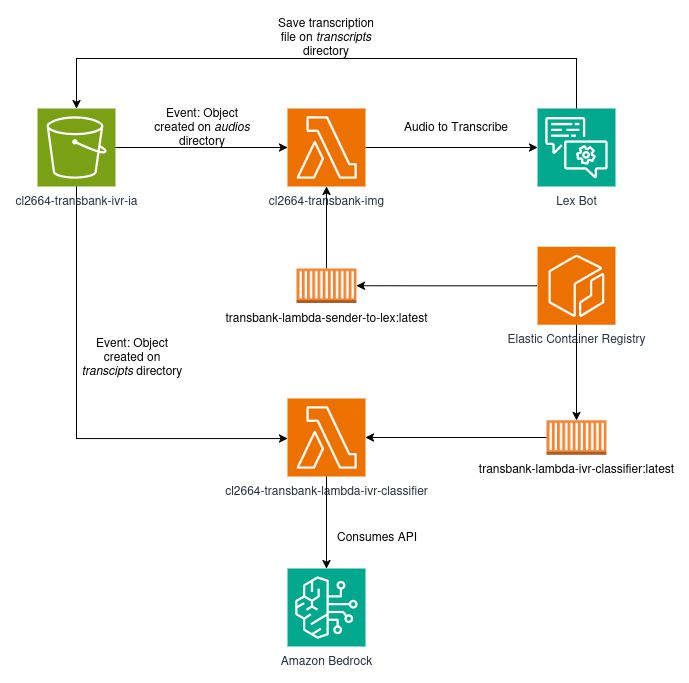
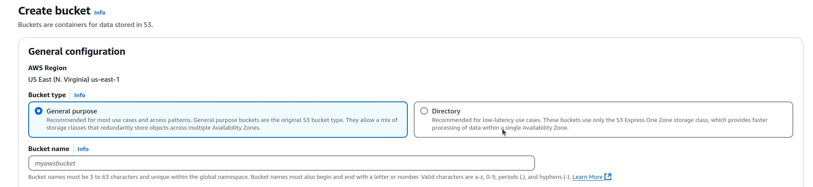
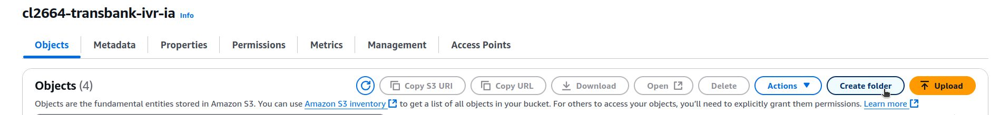
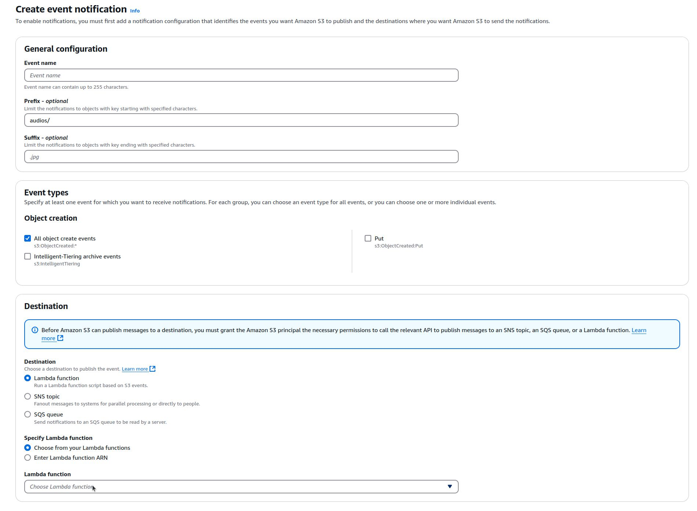

# Nubiral - Modelo IA/IVR Transbank

## **Análisis y estrategias de mejora del modelo de clasificación**

### **Objetivo**

Este proyecto tiene como objetivo desarrollar un modelo de Inteligencia Artificial para predecir la cola de atención adecuada en un sistema IVR (Respuesta de Voz Interactiva) de Transbank. La predicción se basa en el mensaje del usuario, obtenido a través del AST (Abstract Syntax Tree) de Amazon Lex.

### **Datos**

1.  **Fuente:** Se utilizó un archivo Excel (`KB2000_test_audio_inferido_ofuscado.xlsm`).
2.  **Columnas Relevantes:** `Etiqueta` (la cola objetivo/categoría), `Intencion` (intención generalizada del usuario), `Problema` (problema generalizado del usuario).
3.  **Preprocesamiento:**
    *   Se manejaron valores nulos (`fillna("")`).
    *   Se creó una columna `full_text` concatenando `Intencion` y `Problema` para tener el texto completo de la interacción del usuario.
4.  **División:** El conjunto de datos se dividió en entrenamiento (75%) y prueba (25%) utilizando `train_test_split` de scikit-learn (`test_size=0.25`, `random_state=42`). Se aplicó estratificación según la columna `etiqueta` para mantener la proporción de clases en ambos conjuntos.
5.  **Aumento de Datos (Augmentation):**
    *   Se utilizó el modelo **Claude 3.7 Sonnet** a través de AWS Bedrock para generar datos sintéticos.
    *   Se creó un prompt específico (`SYNTHETIC_DATA_PROMPT`) que tomaba ejemplos reales de cada categoría del conjunto de *entrenamiento* y le pedía al LLM generar 5 nuevos ejemplos sintéticos por categoría, manteniendo la estructura (`full_text`, `etiqueta`).
    *   Los datos sintéticos generados se añadieron exclusivamente al conjunto de **entrenamiento** para mejorar la robustez del modelo sin afectar la evaluación en el conjunto de prueba.
    *   La distribución de clases en el conjunto de entrenamiento se vio más balanceada tras el aumento.

### **Metodología y Pruebas Realizadas**

Se exploraron diversos enfoques para la clasificación de los textos de los usuarios:

#### 1. Métodos Clásicos de Machine Learning

*   **Baseline (TF-IDF + Regresión Logística):**
    *   Se vectorizó el texto (`full_text`) utilizando TF-IDF (`TfidfVectorizer`).
    *   Se entrenó un modelo de Regresión Logística sobre las características TF-IDF del conjunto de *entrenamiento aumentado*.
*   **Embeddings + Regresión Logística:**
    *   Se generaron embeddings para la columna `full_text` utilizando dos modelos diferentes de AWS Bedrock:
        *   **Amazon Titan Embeddings**
        *   **Cohere Embeddings**
    *   Se entrenaron modelos de Regresión Logística separados utilizando cada tipo de embedding como características. Estos modelos se entrenaron sobre el conjunto de *entrenamiento original* (usando los índices de la división inicial).

#### 2. Métodos de IA Generativa (GenAI - Few-Shot / In-Context Learning)

Estos enfoques utilizan Large Language Models (LLMs) directamente para la clasificación, aprovechando su capacidad de entender el contexto proporcionado en el prompt.

*   **Enfoque "Transbank":**
    *   Se construyó una base de conocimiento (`kb`) concatenando la `etiqueta` y el `full_text` de *todo el conjunto de entrenamiento aumentado*.
    *   Se creó un prompt que incluía:
        *   El texto del usuario a clasificar.
        *   La base de conocimiento completa (`kb`).
        *   Una lista explícita de las posibles `etiquetas`.
        *   Instrucciones claras para que el LLM devolviera *únicamente* la etiqueta más probable.
    *   Se realizaron inferencias sobre el conjunto de *prueba* utilizando dos modelos de AWS Bedrock:
        *   **Claude 3.5 Sonnet**
        *   **Claude 3.7 Sonnet**

*   **Enfoque "Nubiral" (Extracción de Patrones + Inferencia):**
    *   **Paso 1: Extracción de Patrones:**
        *   Se diseñaron varios "Prompts de Extracción de Patrones" (PEPs) con diferentes estrategias (Original, Gemini Pro Exp, Gemini Thinking, R1, Sonnet 3.7, GPT).
        *   Cada PEP se ejecutó utilizando **Claude 3.7 Sonnet** sobre los textos agrupados por categoría del *conjunto de entrenamiento aumentado*.
        *   El objetivo era que el LLM generara resúmenes, patrones de intención/problema y palabras clave *específicas para cada categoría*. Estos patrones generados se guardaron.
    *   **Paso 2: Inferencia:**
        *   Se creó un prompt general (`GENERAL_PROMPT`) que tomaba:
            *   El contexto generado por *uno* de los PEPs para *todas* las categorías.
            *   El texto del usuario a clasificar.
            *   Instrucciones para seleccionar la categoría más adecuada y devolverla en formato JSON (`{"choice": "[Categoría]"}`).
        *   Se realizaron inferencias sobre el conjunto de *prueba* utilizando **Claude 3.5 Sonnet**, probando el contexto generado por *cada una de las variantes de PEP*.

### **Resultados**

Se evaluó el rendimiento de todos los métodos en el conjunto de **prueba** (sin datos sintéticos). Las métricas principales fueron Accuracy, Precision, Recall y F1-Score (promedio ponderado).

| Método                             | Accuracy | Precision | Recall   | F1-Score |
| :--------------------------------- | :------- | :-------- | :------- | :------- |
| TF-IDF (Baseline)                  | 0.6316   | 0.6179    | 0.6316   | 0.5941   |
| Embeddings Titan + LogReg          | 0.6579   | 0.6969    | 0.6579   | 0.6198   |
| Embeddings Cohere + LogReg         | 0.5526   | 0.5159    | 0.5526   | 0.5164   |
| GenAI Transbank (Claude 3.5 Sonnet)| 0.5526   | 0.5755    | 0.5526   | 0.4888   |
| GenAI Transbank (Claude 3.7 Sonnet)| 0.5789   | 0.6057    | 0.5789   | 0.5225   |
| **GenAI Nubiral (PEP Gemini Pro Exp)**| **0.7368** | **0.8176**  | **0.7368** | **0.6912** |
| GenAI Nubiral (PEP R1)             | 0.7105   | 0.7343    | 0.7105   | 0.6493   |
| GenAI Nubiral (PEP Original)       | 0.6842   | 0.6765    | 0.6842   | 0.6597   |
| GenAI Nubiral (PEP Sonnet 3.7)     | 0.6842   | 0.7154    | 0.6842   | 0.6634   |
| GenAI Nubiral (PEP GPT)            | 0.6842   | 0.7154    | 0.6842   | 0.6634   |
| GenAI Nubiral (PEP Gemini Thinking)| 0.6579   | 0.6286    | 0.6579   | 0.6318   |

*(Nota: Las métricas para los modelos GenAI Transbank se extrajeron de las visualizaciones/reportes generados en la celda 39, y las de Nubiral de la celda 53 y el DataFrame `results_full_df`)*

**Observaciones:**

*   El enfoque **Nubiral**, que utiliza patrones específicos de categoría generados por un LLM (Claude 3.7 Sonnet) y luego realiza la inferencia (con Claude 3.5 Sonnet), superó significativamente a los métodos clásicos y al enfoque GenAI "Transbank".
*   Dentro del enfoque Nubiral, el prompt de extracción de patrones denominado **"PEP Gemini Pro Exp"** obtuvo el mejor rendimiento general (Accuracy: 0.7368, F1-Score: 0.6912).
*   El uso de embeddings (Titan y Cohere) con Regresión Logística mostró resultados mixtos, con Titan superando ligeramente al baseline TF-IDF, pero Cohere rindiendo por debajo.
*   El aumento de datos en el conjunto de entrenamiento parece haber beneficiado a los modelos.

### **Potencial Despliegue (Lambda)**

Se incluye un ejemplo en la carpeta `ivr_classifier` de cómo se podría estructurar una función AWS Lambda (`lambda_handler`) para desplegar el clasificador. Este ejemplo utiliza la clase `IvrClassifier` desarrollada en el proyecto, que encapsula la lógica de carga del modelo (potencialmente desde S3) y la predicción. Se utiliza `aws-lambda-powertools` para el logging estructurado.

### **Conclusión**

#### Descargo de responsabilidad

Las pruebas se llevaron a cabo utilizando un conjunto de datos de tamaño reducido, cuya representatividad respecto a la población objetivo presenta limitaciones significativas. Por lo tanto, los resultados presentados a continuación deben interpretarse con cautela.

Se optaron por diversos enfoques, finalmente se demostró la superioridad del enfoque de IA Generativa propuesto por **Nubiral**, que combina la extracción de patrones específicos por categoría mediante un LLM (Claude 3.7 Sonnet) con una posterior inferencia utilizando otro LLM (Claude 3.5 Sonnet). Este método, particularmente con los patrones generados por el prompt **"PEP Gemini Pro Exp"**, alcanzó la mayor precisión (Accuracy: 0.7368) y F1-Score (0.6912) en el conjunto de prueba.

Este rendimiento supera notablemente a los métodos clásicos basados en TF-IDF y Embeddings, así como al enfoque GenAI más directo ("Transbank") que utiliza toda la base de conocimiento en el prompt. La generación de un contexto más refinado y específico por categoría parece ser clave para mejorar la capacidad del LLM para clasificar correctamente las intenciones de los usuarios.

Se recomienda seguir realizando pruebas del **enfoque Nubiral con el prompt PEP Gemini Pro Exp** para comprobar si la mejoría de la asertividad solo funciona con este conjunto de datos o si puede aplicarse globalmente. La estructura propuesta para una función Lambda facilita su potencial despliegue en un entorno productivo.

### **Pasos futuros**
- Aumentar la cantidad de muestras disponibles, acompañado de un proceso de depuración que garantice una mayor calidad y representatividad de los datos.

- Explorar la aplicación de técnicas de fine-tuning sobre modelos preentrenados como BERT, con el objetivo de mejorar el desempeño en tareas específicas.

- Evaluar e implementar algoritmos de conversión de audio a texto más avanzados, alineándose con el estado del arte (State of the Art, SOTA).

- Estimar el volumen de uso futuro de la herramienta, a fin de seleccionar la arquitectura más adecuada, considerando tanto los requisitos técnicos como la viabilidad económica de la solución.

## **Análisis y estrategias de mejora del modelo de transcripción**

### **Objetivo**

Este proyecto tiene como objetivo automatizar el proceso de análisis de grabaciones de audio (presumiblemente de un call center) almacenadas en Amazon S3. El sistema transcribe las grabaciones, utiliza un Modelo de Lenguaje Grande (LLM) para identificar la **intención principal** expresada por el cliente, y localiza el **segmento exacto** de la transcripción (con tiempos de inicio y fin) donde se manifiesta dicha intención. El resultado final es un archivo estructurado (CSV) que facilita análisis posteriores.

### **Datos**

1.  **Fuente:** Archivos de audio en formatos `.m4a` y `.opus` ubicados en el bucket de Amazon S3: `cl2664-s3-demo-transbank-transcribe`.
2.  **Datos Intermedios:** La salida del servicio AWS Transcribe, que incluye:
    *   La transcripción completa del audio.
    *   Una lista detallada de `items`, donde cada ítem representa una palabra o signo de puntuación detectado, junto con sus tiempos de inicio y fin, y posibles alternativas de transcripción.
3.  **Preprocesamiento (para localización de intención):**
    *   Dentro de la lógica de localización (`_find_intent_times`), se aplica normalización de texto tanto a la intención extraída por el LLM como a las palabras de la transcripción (`items`). Esta normalización incluye: conversión a minúsculas, eliminación de signos de puntuación y acentos, y eliminación de espacios extra. Esto se hace para mejorar la robustez de la coincidencia entre la intención y el texto transcrito.
4.  **División:** No se realiza una división explícita en conjuntos de entrenamiento y prueba. El script procesa *todos* los archivos de audio encontrados en el bucket S3 especificado.
5.  **Aumento de Datos (Augmentation):** No se utiliza aumento de datos en este notebook.

### **Metodología y Pruebas Realizadas**

El notebook implementa un único flujo de trabajo secuencial para cada archivo de audio. No compara diferentes métodos, sino que ejecuta un proceso definido:

1.  **Transcripción Automática (Speech-to-Text):**
    *   Se utiliza el servicio **AWS Transcribe**.
    *   Se configura para el idioma español (`es-US`).
    *   Se habilitan las opciones `ShowSpeakerLabels` (para identificar hablantes, aunque no se usa explícitamente en la lógica posterior) y `ShowAlternatives` (para obtener transcripciones alternativas por palabra, usadas implícitamente en la coincidencia).
    *   El script inicia un trabajo de transcripción por archivo, espera su finalización y recupera el resultado en formato JSON.

2.  **Extracción de Intención Principal (LLM):**
    *   Se utiliza un cliente LLM (`LLMClient` del módulo `src.bedrock_models_v2`) interactuando con **AWS Bedrock**.
    *   El modelo LLM especificado es **Claude 3.7 Sonnet**.
    *   Se envía la transcripción completa al LLM junto con un `system_prompt` específico que instruye al modelo para identificar la necesidad principal del cliente en un contexto de call center bancario y extraer el fragmento de texto exacto que la expresa (entre comillas).
    *   Se extrae la intención textual de la respuesta del LLM (priorizando el texto entre comillas).

3.  **Localización Temporal de la Intención (Coincidencia Difusa):**
    *   Se implementa una lógica personalizada (`_find_intent_times`) para encontrar la secuencia de palabras (normalizadas) correspondientes a la intención extraída dentro de la lista de `items` (palabras normalizadas con tiempos) de la transcripción.
    *   Se utiliza una función de similitud de palabras personalizada (`_word_similarity`) y un enfoque de ventana deslizante para encontrar la mejor secuencia coincidente.
    *   Se calcula una puntuación de **confianza** (0-1) basada en la calidad de la coincidencia (proporción de palabras coincidentes y su similitud).
    *   Se determinan los **tiempos de inicio y fin** basados en los tiempos de la primera y última palabra de la secuencia mejor coincidente encontrada (si supera un umbral de confianza).
    *   Si no se encuentra una coincidencia satisfactoria, se registra como `NO_INTENT_DETECTED` (o se reporta la mejor coincidencia parcial si supera un umbral inferior).

4.  **Almacenamiento de Resultados:**
    *   Los resultados (nombre de archivo, transcripción, intención, tiempos, confianza) se recopilan en un DataFrame de Pandas.
    *   El DataFrame se guarda en un archivo CSV con un timestamp en el nombre y usando `|` como delimitador.

### **Resultados**

La ejecución mostrada en la salida del notebook procesó 9 archivos de audio.

*   **Archivos Procesados:** 9
*   **Archivos con Intención Detectada y Localizada:** 8 (88%)
*   **Archivos Sin Intención Clara (o fallo en localización):** 1 (11%)
    *   Se reportó explícitamente un fallo en la localización para la intención "poner una nota" en uno de los archivos, indicando una confianza de coincidencia insuficiente (0.67, por debajo del umbral primario).
*   **Salida Detallada:** Se generó un archivo CSV (ej: `transcriptions_with_intent_20250321_124532.csv`) con las siguientes columnas para cada archivo procesado:
    *   `audio_file`: Nombre del archivo original.
    *   `transcript`: Transcripción completa.
    *   `intent_text`: Texto de la intención extraída (o estado como `NO_INTENT_DETECTED`).
    *   `intent_detected`: Booleano indicando éxito.
    *   `start_time`: Tiempo de inicio de la intención (segundos).
    *   `end_time`: Tiempo de fin de la intención (segundos).
    *   `confidence`: Puntuación de confianza de la localización.

### **Conclusión**

El notebook demuestra un flujo de trabajo efectivo para automatizar la extracción de información clave (transcripción e intención principal localizada) a partir de grabaciones de audio utilizando una combinación de servicios de AWS (S3, Transcribe, Bedrock con Claude 3.7 Sonnet) y lógica personalizada de procesamiento de texto (normalización y coincidencia difusa). El enfoque logra identificar y ubicar temporalmente la necesidad principal del cliente en la mayoría de los casos procesados.

La principal fortaleza radica en la integración de la transcripción detallada (con tiempos por palabra) y la capacidad de comprensión del LLM, unidas por un algoritmo de coincidencia para anclar la intención detectada en la línea de tiempo del audio. El fallo observado en la localización de una intención sugiere que el algoritmo de coincidencia o sus umbrales podrían requerir ajustes para manejar ciertos casos.

## Arquitectura

El equipo de Nubiral decidió construir la siguiente arquitectura dentro de AWS para poder demostrar las capacidades que tiene el servicio **Amazon Lex**, **AWS Bedrock** y **AWS Lambda**.

### Componentes

#### Bucket de S3

Para poder simular el comportamiento de Genesys Cloud, el equipo optó por realizar la ingesta de datos al sistema mediante un Bucket de **AWS S3**.

Este Bucket va a guardar:
- Los audios a clasificar
- Los resultados de las transcripciones realizadas por Amazon Lex
- Los modelos creados por los Data Scientists del equipo

##### Estructura del Bucket

Para mantener el orden dentro del Bucket, se crearon tres directorios:
- `models`
- `transcripts`
- `audios`

##### Event Notifications del Bucket

El Bucket tiene configuradas dos Event Notifications:

1. **Evento 1:**  
   - Tipo: `s3:ObjectCreated:*` en el directorio `audios`  
   - Función: Llama a una Lambda encargada de comunicarse con Amazon Lex.  
   - Propósito: Inicia el mecanismo del sistema.

2. **Evento 2:**  
   - Tipo: `s3:ObjectCreated:*` en el directorio `transcripts`  
   - Función: Llama a otra Lambda que realiza la clasificación del texto transcripto por Lex.

##### Configuración del Bucket

Pasos seguidos para la creación y configuración del Bucket:

1. Navegar a AWS S3 y crear un nuevo Bucket.

2. Configurarlo como **General Purpose**, asignar nombre y dejar opciones por defecto.

3. Crear los directorios: `audios`, `models`, `transcripts`.

4. Configurar los eventos:
   - Ir a **Properties > Event Notifications**
   - Seleccionar **Create event notification**
   - **Nota:** Las Lambda functions deben estar previamente creadas.

#### Lambda que interactúa con Lex

Lambda diseñada para:
- Tomar los audios desde el Bucket
- Transformarlos a un formato compatible con Amazon Lex
- Enviar los audios a Amazon Lex

#### Amazon Lex

Servicio utilizado para realizar la transcripción de los audios cargados al Bucket S3.

#### Lambda que realiza la clasificación del texto

El nombre de esta lambda es `ivr-classifier`, se activa cuando se genera un nuevo archivo en el directorio `transcripts` y se encarga de clasificar el texto que fue transcripto por *Lex* utilizando las capacidades de *Amazon Bedrock*.
